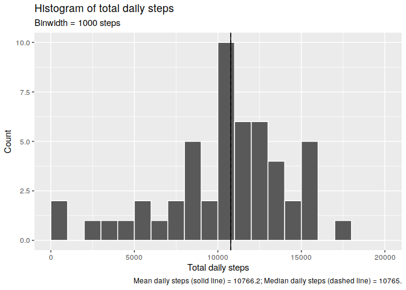
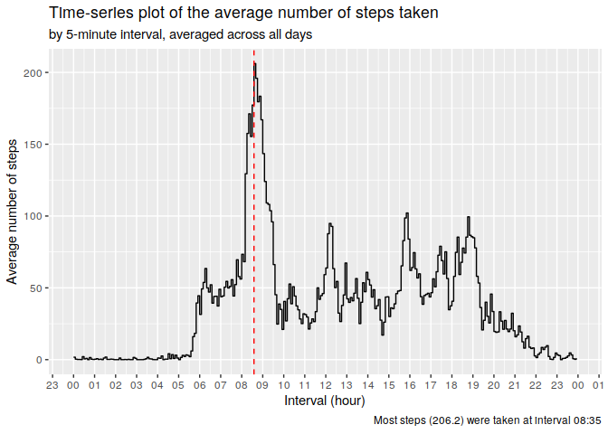
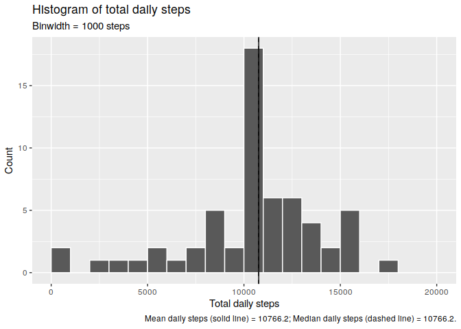
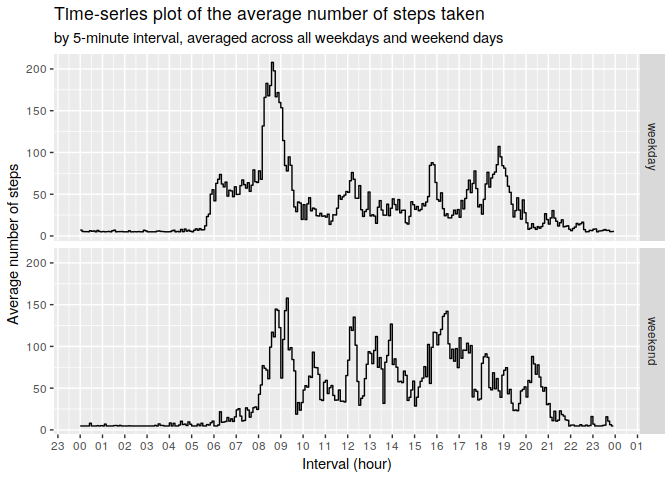

## Loading and preprocessing the data

```r
library(tidyverse)
```

```
## ── Attaching packages ─────────────────────────────────────────────────────────────────────────────────────────────────────────────────────────────── tidyverse 1.2.1 ──
```

```
## ✔ ggplot2 3.1.0       ✔ purrr   0.3.1  
## ✔ tibble  2.0.1       ✔ dplyr   0.8.0.1
## ✔ tidyr   0.8.3       ✔ stringr 1.4.0  
## ✔ readr   1.3.1       ✔ forcats 0.4.0
```

```
## ── Conflicts ────────────────────────────────────────────────────────────────────────────────────────────────────────────────────────────────── tidyverse_conflicts() ──
## ✖ dplyr::filter() masks stats::filter()
## ✖ dplyr::lag()    masks stats::lag()
```

```r
Sys.setlocale("LC_TIME","en_US.UTF-8") # force US style dates and times
```

```
## [1] "en_US.UTF-8"
```

```r
#setwd("~/Desktop/coursera/reproductible_research")
unzip("activity.zip")

# interval is stored in a weird format so it needs to parsed. 
# It is a number formed by joining together the hour and minute without separator (so %H%M), then taking only the significant digits.
# My approach was to fill in the missing leading "0"-s, extract the hours and minutes, concatenate them in teh form "01:05" (so %H:%M) and then to convert them to a proper date/time representation when needed.

activity <- read.csv("activity.csv", 
                     colClasses = c("integer", "character", "character")) %>%
  mutate (date = lubridate::ymd(date), 
          interval = str_pad(interval, pad = "0", width = 4),
          #hour  =  str_sub(interval, 1, 2) %>% as.numeric(),
          #minute = str_sub(interval, 3, 4) %>% as.numeric(),
          interval2 = paste0(str_sub(interval, 1, 2), ":", 
                             str_sub(interval, 3, 4) ))


#str(activity)
```


## What is mean total number of steps taken per day?

For this part of the assignment, you can ignore the missing values in the dataset.

1. Make a histogram of the total number of steps taken each day

2. Calculate and report the mean and median total number of steps taken per day


```r
# Make a temporary data frame
df <- activity %>% 
  group_by(Date=date) %>%
  summarise(`Total daily steps`=sum(steps))

# Calculate the mean and median total number of steps taken per day
mean_steps <- mean(df$`Total daily steps`, na.rm=T) # 10766.19
median_steps <- median(df$`Total daily steps`, na.rm=T) # 10765
mean_and_median_steps <- paste0("Mean daily steps (solid line) = ", round(mean_steps, 1), 
                        "; Median daily steps (dashed line) = ", round(median_steps, 1), ".")

# Make a histogram of the total number of steps taken each day
df %>%
  #ggplot(aes(x=Date, y=`Total daily steps`)) + geom_bar(stat="identity")
  ggplot(aes(x=`Total daily steps`)) + geom_histogram(breaks=seq(0,20000, 1000), color="white") +
  geom_vline(xintercept = mean_steps, linetype="solid")+
  geom_vline(xintercept = median_steps, linetype="dashed")+
  labs(title="Histogram of total daily steps", subtitle="Binwidth = 1000 steps",
       y="Count", x="Total daily steps", 
       caption = mean_and_median_steps)
```

```
## Warning: Removed 8 rows containing non-finite values (stat_bin).
```

<!-- -->

```r
#mean_and_median_steps
```


## What is the average daily activity pattern?

Make a time series plot (i.e. type = "l") of the 5-minute interval (x-axis) and the average number of steps taken, averaged across all days (y-axis).

Which 5-minute interval, on average across all the days in the dataset, contains the maximum number of steps?


```r
# Make a temporary data frame
# I could not group by a date/time variable so I used its character representation.
# I then converted the interval to a proper date/time format. 
# It is important to use tz="GMT" in order to keep the original value. 
# origin could just as be any random date, since no information regading date is actualy used.

df <- activity %>%
  group_by(interval2) %>%
  summarise(`Average steps`= mean(steps, na.rm=T)) %>%
  mutate(interval2=as.POSIXct(interval2, "%H:%M", origin=Sys.Date(), tz="GMT"))

max_steps <- max(df$`Average steps`)
max_time <- df$interval2[which.max(df$`Average steps`)]

# Make a histogram of the total number of steps taken each interval
df %>%
  ggplot(aes(x=interval2, y=`Average steps`)) +
  #geom_line(group=1 )+
  geom_step(group=1 )+ # step will show a short horizontal line during all the 5-min interval
  scale_x_datetime(date_breaks = "1 hour", date_labels = "%H")+
  geom_vline(xintercept = max_time, linetype="dashed", color="red", size=0.5)+
  labs(title="Time-series plot of the average number of steps taken", 
       subtitle="by 5-minute interval, averaged across all days",
       y="Average number of steps", x="Interval (hour)", 
       caption = paste0("Most steps (", round(max_steps, 1), 
                        ") were taken at interval ", format(max_time, "%H:%M")))
```

<!-- -->


## Imputing missing values

Note that there are a number of days/intervals where there are missing values (coded as NA). The presence of missing days may introduce bias into some calculations or summaries of the data.

1. Calculate and report the total number of missing values in the dataset (i.e. the total number of rows with NAs).

__Total number of rows with missing data = 2304. __

2. Devise a strategy for filling in all of the missing values in the dataset. The strategy does not need to be sophisticated. For example, you could use the mean/median for that day, or the mean for that 5-minute interval, etc.

3. Create a new dataset that is equal to the original dataset but with the missing data filled in.


```r
activity2 <- activity

#repalce missing step counts with means
activity2$steps[is.na(activity2$steps)] <- mean(activity2$steps, na.rm=T)

# 
# activity2$interval[12] <- NA
# activity2$interval2[12] <- NA
# 
# activity2$interval2[1:10] %>% 
#   as.POSIXct("%H:%M", origin=Sys.Date(), tz="GMT") %>% 
#   mean(na.rm=T) %>% 
#   lubridate::round_date("5 minutes")
# 
# x <- activity2$interval2[9:16] %>% as.POSIXct("%H:%M", origin=Sys.Date(), tz="GMT")
# imputeTS::na.interpolation(as.numeric(x)) %>% 
#   as.POSIXct(origin="1970-01-01", tz="GMT")
# 
# 
# d <- diff(activity2$interval2 %>% as.POSIXct("%H:%M", origin=Sys.Date(), tz="GMT"))
# d[is.na(d)] <- 5
# 
# d[d!=5]
```

4. Make a histogram of the total number of steps taken each day and Calculate and report the mean and median total number of steps taken per day. Do these values differ from the estimates from the first part of the assignment? What is the impact of imputing missing data on the estimates of the total daily number of steps?


```r
# Make a temporary data frame
df <- activity2 %>% 
  group_by(Date=date) %>%
  summarise(`Total daily steps`=sum(steps))

# Calculate the mean and median total number of steps taken per day
mean_steps <- mean(df$`Total daily steps`, na.rm=T) # 10766.19
median_steps <- median(df$`Total daily steps`, na.rm=T) # 10765
mean_and_median_steps <- paste0("Mean daily steps (solid line) = ", round(mean_steps, 1), 
                        "; Median daily steps (dashed line) = ", round(median_steps, 1), ".")

# Make a histogram of the total number of steps taken each day
df %>%
  #ggplot(aes(x=Date, y=`Total daily steps`)) + geom_bar(stat="identity")
  ggplot(aes(x=`Total daily steps`)) + geom_histogram(breaks=seq(0,20000, 1000), color="white") +
  geom_vline(xintercept = mean_steps, linetype="solid")+
  geom_vline(xintercept = median_steps, linetype="dashed")+
  labs(title="Histogram of total daily steps", subtitle="Binwidth = 1000 steps",
       y="Count", x="Total daily steps", 
       caption = mean_and_median_steps)
```

<!-- -->

```r
#mean_and_median_steps
```

By replacing missing values with the mean of the remaining values, the mean number of steps does not change (as expected) but the median changes slightly and is now equal to the mean. However, the shape of the histogram changes and now the 10000 to 11000 bin holds relatively more values because all the previously missing values contribute to it.


## Are there differences in activity patterns between weekdays and weekends?

For this part the weekdays() function may be of some help here. Use the dataset with the filled-in missing values for this part.

1. Create a new factor variable in the dataset with two levels -- "weekday" and "weekend" indicating whether a given date is a weekday or weekend day.


```r
activity2 <- activity2 %>% 
  mutate(day = weekdays(date), 
         day.type = ifelse(day %in% c("Saturday", "Sunday"), 
                           "weekend", "weekday"))
```

2. Make a panel plot containing a time series plot (i.e. type = "l") of the 5-minute interval (x-axis) and the average number of steps taken, averaged across all weekday days or weekend days (y-axis).


```r
df <- activity2 %>%
  group_by(day.type, interval2) %>%
  summarise(`Average steps`= mean(steps, na.rm=T)) %>%
  mutate(interval2=as.POSIXct(interval2, "%H:%M", origin=Sys.Date(), tz="GMT"))

# Make a histogram of the total number of steps taken each interval
df %>%
  ggplot(aes(x=interval2, y=`Average steps`)) +
  facet_grid(day.type~.)+
  geom_step(group=1 )+ # step will show a short horizontal line during all the 5-min interval
  scale_x_datetime(date_breaks = "1 hour", date_labels = "%H")+
  labs(title="Time-series plot of the average number of steps taken", 
       subtitle="by 5-minute interval, averaged across all weekdays and weekend days",
       y="Average number of steps", x="Interval (hour)")
```

<!-- -->


I took the liberty to use ggplot2 instead of latice since I am trying to learn this system. Therefore, I force myself to use ggplot2 for all charts, even if the same could be drawn easier with base/latice.
